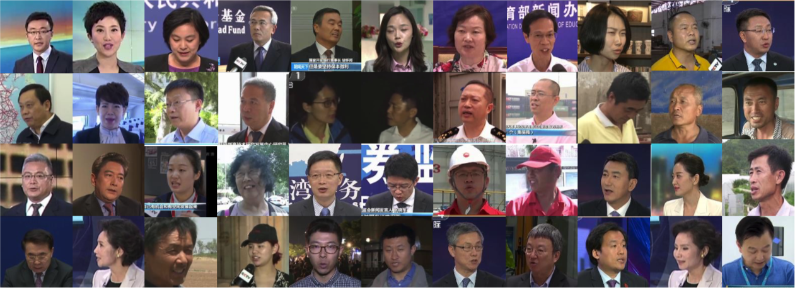

# Lipreading-DenseNet3D
DenseNet3D Model In "DenseNet3D Model In "LRW-1000: A Naturally-Distributed Large-Scale Benchmark for Lip Reading in the Wild", https://arxiv.org/abs/1810.06990



## Update

`2020-12-10`: Please check https://github.com/Fengdalu/learn-an-effective-lip-reading-model-without-pains for our base models, which provides more detailed configuration on LRW and LRW-1000.

## Introduction   

This respository is implementation of the proposed DenseNet-3D network in [LRW-1000: A Naturally-Distributed Large-Scale Benchmark for Lip Reading in the Wild](https://arxiv.org/pdf/1810.06990.pdf). Our paper can be found [here](https://arxiv.org/pdf/1810.06990.pdf).

## Data Preparation

Download [LRW1000 Dataset](https://vipl.ict.ac.cn/view_database.php?id=14) and place `LRW1000_Public` in the root of this repository. Instead, you can create symbolic links to this project: 

```
ln -s LRW1000_Public Lipreading-DenseNet3D/LRW1000_Public
```

## Training And Testing

You can train or test the model by running: 

```
python main.py options_lip.toml
```

Model architecture details and data annotation items are configured in `options_lip.toml`. Please pay attention that you may need modify the code in `options_lip.toml` and change the parameters to make the scripts work just as expected. 

## Dependencies

* PyTorch 1.0+
* toml
* tensorboardX 
* imageio

## Reference

If this repository was useful for your research, please cite our work:

```
@inproceedings{yang2019lrw,
  title={LRW-1000: A Naturally-Distributed Large-Scale Benchmark for Lip Reading in the Wild},
  author={Yang, Shuang and Zhang, Yuanhang and Feng, Dalu and Yang, Mingmin and Wang, Chenhao and Xiao, Jingyun and Long, Keyu and Shan, Shiguang and Chen, Xilin},
  booktitle={2019 14th IEEE International Conference on Automatic Face \& Gesture Recognition (FG 2019)},
  pages={1--8},
  year={2019},
  organization={IEEE},
  url={https://github.com/Fengdalu/Lipreading-DenseNet3D}
}
```


## Related Projects

[Another implmentation Of DenseNet-3D](https://github.com/NirHeaven/D3D)

[Learn an Effective Lip Reading Model without Pains (Strong Recommended)](https://github.com/Fengdalu/learn-an-effective-lip-reading-model-without-pains) 

[LipNet-PyTorch (The state-of-the-art PyTorch Version)](https://github.com/Fengdalu/LipNet-PyTorch) 

[End-to-end-lipreading](https://github.com/mpc001/end-to-end-lipreading)

[Lipreading using Temporal Convolutional Networks](https://github.com/mpc001/Lipreading_using_Temporal_Convolutional_Networks)
